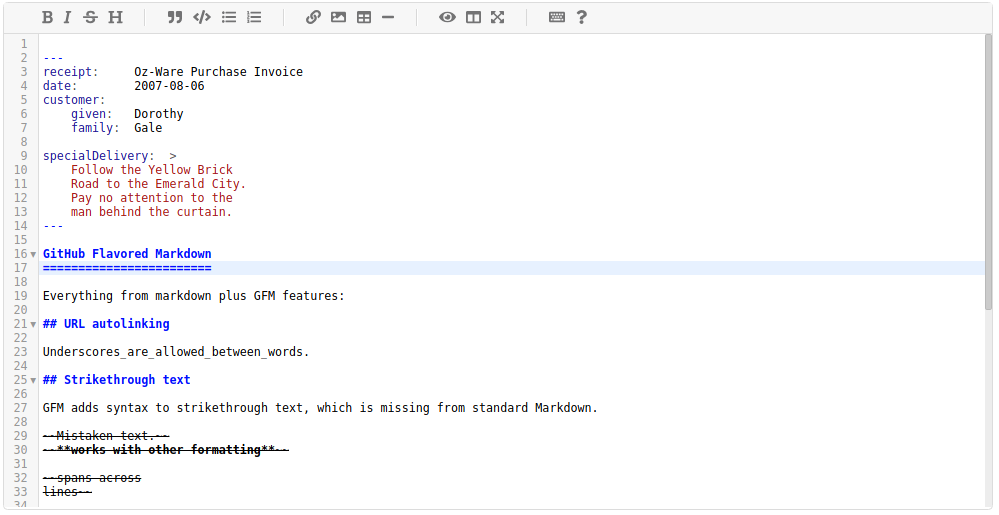
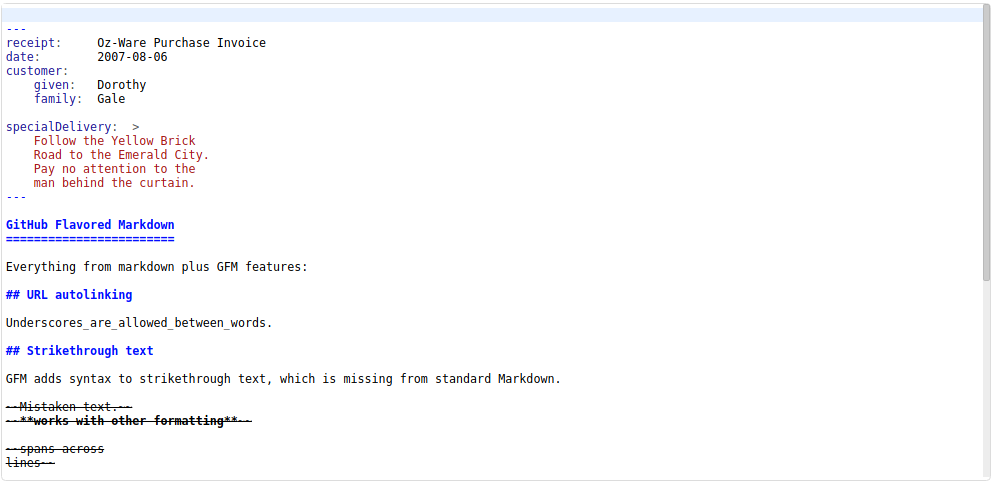
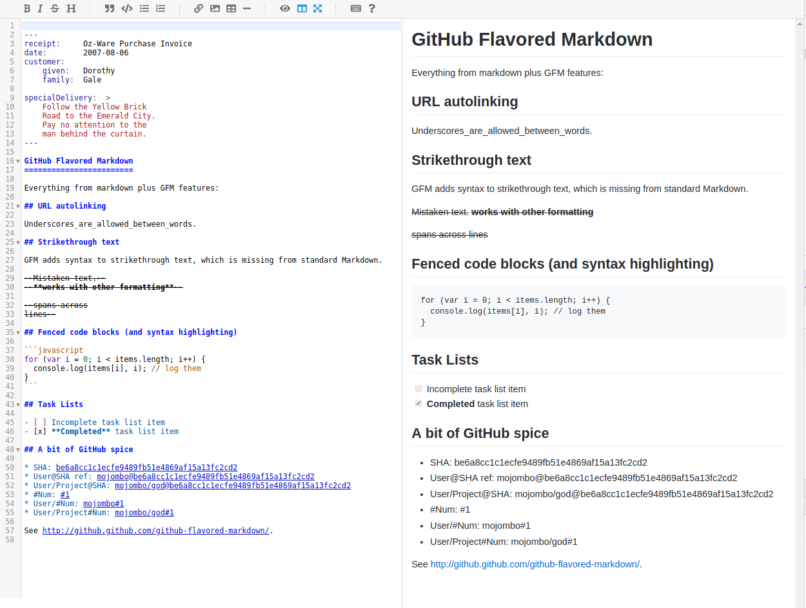
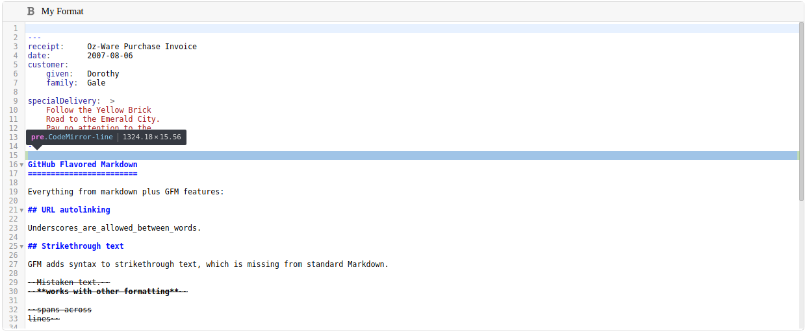
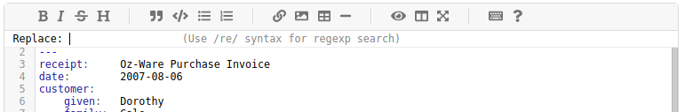

**[English](#promarkdown)**    **[中文](#中文)**

# ProMarkdown

## Introduction

ProMarkdown is a professional grade React markdown editor based on CodeMirror, for programmers and professional tech writters.

[Github home](https://github.com/reactma/promarkdown)

It provides following features for more sophiscated markdown editing:

- Frontmatters, YAML / TOML /JSON, which is the main reason for developing ProMarkdown
- Keymap, Vim / Sublime / Emacs, and obviously default
- Line numbers
- Block folding
- Preview / Fullscreen / Editing and live preview
- Search and replace
- I18n, with build zh-CN ( Simplified Chinese ) suppport. Developers can provide custom phrases for menu tips / search / replace labels.
- Toolbar / menu: a default menu supporting major markdown formats
- Extensible - it exposes underlying CodeMirror instance and allows you to plugin your own menu, custom preview and low level CodeMirror eventhandlers.

## Built with Typescript

ProMarkdown is built with Typescript. But you don't need TS to use it as a library. Exported types are generated by TSC and provided with the library.

## Demo

### Default Editor with front matter highlighting



### Bare editor - no menu and linenumbers



### Live edit and preview



### Custom menu



### Search and replace



## Quitck start

Clone the repo:

`git clone https://github.com/reactma/promarkdown`

Enter the repo:

`cd promarkdown`

Install dependencies

`yarn`

Run demo:

`yarn dev`

Build library:

`yarn build`


## Usage

### Install

```
yarn add promarkdown
```

or

```
npm install promarkdown
```


### Basic usage

**Important: You must import style sheets or provide your own customization**

```
import * as React from 'react'
import * as ReactDOM from 'react-dom'

/*** Important : You must import style sheets or provide your own customization ***/

import 'codemirror/lib/codemirror.css'
import 'codemirror/addon/fold/foldgutter.css'
import 'codemirror/addon/scroll/simplescrollbars.css'
import 'codemirror/addon/dialog/dialog.css'
import 'codemirror/addon/search/matchesonscrollbar.css'

import 'promarkdown/matchhighlighter.css'
import 'promarkdown/promarkdown.css'
import 'promarkdown/gitmarkdown.css'
import 'promarkdown/keymapmenu.css'

/*** End of Important ******************/


import ProMarkdown, { IProMarkdownProps } from 'promarkdown'

const initialValue = `
---
receipt:     Oz-Ware Purchase Invoice
date:        2007-08-06
customer:
    given:   Dorothy
    family:  Gale

specialDelivery:  >
    Follow the Yellow Brick
    Road to the Emerald City.
    Pay no attention to the
    man behind the curtain.
---

GitHub Flavored Markdown
========================

Everything from markdown plus GFM features:

## URL autolinking

Underscores_are_allowed_between_words.

## Strikethrough text

GFM adds syntax to strikethrough text, which is missing from standard Markdown.

~~Mistaken text.~~
~~**works with other formatting**~~

~~spans across
lines~~

## Fenced code blocks (and syntax highlighting)

\`\`\`javascript
for (var i = 0; i < items.length; i++) {
  console.log(items[i], i); // log them
}
\`\`\`

## Task Lists

- [ ] Incomplete task list item
- [x] **Completed** task list item

## A bit of GitHub spice

* SHA: be6a8cc1c1ecfe9489fb51e4869af15a13fc2cd2
* User@SHA ref: mojombo@be6a8cc1c1ecfe9489fb51e4869af15a13fc2cd2
* User/Project@SHA: mojombo/god@be6a8cc1c1ecfe9489fb51e4869af15a13fc2cd2
* \#Num: #1
* User/#Num: mojombo#1
* User/Project#Num: mojombo/god#1

See http://github.github.com/github-flavored-markdown/.
`

const atChange = (
  editor: CodeMirror.Editor,
  change: CodeMirror.EditorChange,
  value: string // Changed value
) => console.log(Editor changed >>>>>>>>', editor, change, value)

ReactDOM.render(<ProMarkdown atChange={atChange} initialValue={initialValue} />, document.getElementById('root'))
```

### Advanced

#### ProMarkdown Props

As defined in Typescript interface, follow the comments:

```
interface IProMarkdownProps {
  className?: string  // Your custom class name
  initialValue?: string // Editor initial value
  hideMenu?: boolean // Hidemenu or not, true - hide, false - show
  mode?: { // Editor mode
    name: 'yaml-frontmatter' | 'toml-frontmatter' | 'json-frontmatter' // Frontmatter name, must be one of thme
    base: 'markdown' | 'gfm' // base mode, either markdown or gfm ( Github Flavored Markdown )
  }
  menu?: IProMarkdownMenuItem[] // Your coustom value, continue for more details
  markdownTransformer?: (from: string) => string // Your comstom markdown transformer for preview, as the editor may contain front matter.
  renderPreview?: (props: { value: string }) => React.ComponentElement<any, any> // Your custom preview component
  menuitemTips?: { //Menu item tips, for your local language
    [name: string]: string
  }
  locale?: string //Serach/replace/goto line/ menu tip locale, only support zh-CN and en-US now. Default en-US
  lineNumbers?: boolean // show linenumber or not
  helpLink?: string //Link to help page for Help menu item
  atMounted?: (editor: CodeMirror.Editor) => any // Your handler after Promarkdown is mounted. You can get your codemirror instance for lowlevel CodeMirror manipulation
  atUnmounted?: (editor: CodeMirror.Editor, value: string) => any // Your handler after Remardown is unmounted
  atChange?: (editor: CodeMirror.Editor, change: CodeMirror.EditorChange, value: string) => any // Your handler for editor change. 
  codemirrorOptions?: any // Options that will be passed directly to codemirror
}
```

#### Menu

Promarkdown provides following built-in menus:

```
export type ProMarkdownMenuNames =
  | 'bold' // Bold
  | 'br' // Horizontal ruler
  | 'code' // Code
  | 'eraser' //Erase format
  | 'fullscreen' //Fullscreen mode
  | 'heading' //Headings
  | 'help' //Help page
  | 'image' //Image
  | 'ordered-list' //Ordered list
  | 'quote' //Quote
  | 'italic' //Italic
  | 'link' //Link
  | 'preview' //Preview
  | 'strikethrough' //Strike through
  | 'splitpane' //Splitpane for live edit and preview
  | 'table' //Table
  | 'unordered-list' //Unordered list
  | '|' //Menu item break
```

#### Provide your custom tip for menu item 

Provide menuItemTips prop with following format:

```
interface IMenuItemTips {
  [name: string]: string
}
```

example:

```
{
table: 'Insert table',
bold: 'Set bold'
}
```

#### Build your own custom menus

Provide your own meu props to ProMarkdown

```
menu?: IProMarkdownMenuItem[]
```

IProMarkdownMenuItem type is:

```
interface IProMarkdownMenuItem {
  name: ProMarkdownMenuNames | string // name - if it is one of built-in menu item, your props will be merged to default
  tip: string // menu tip
  className?: string // custom class name
  render?: (props?: IMenuItemRenderProps) => any // Render prop that renders your custom menu item. Continue to find properties of IMenuItemprops
  onClick?: (editor: CodeMirror.Editor, name: string, state: string) => void // Your handler for the menu item if you want to replace the default one.
  link?: string // For help only
}

```

IMenuItemRenderProps type is 

```
interface IMenuItemRenderProps  {
  editor: CodeMirror.Editor // CodeMirror editor
  name: string // name of the menuitem.
  state: string // State of menuitem, if ProMarkdown is able to detect the state, applicable to built-in format menu items only. enabled / disabled / selected
  tip: string // Tip for the custom menu item
}

```

#### Provide your own preview component

You need to provide your own render prop to ProMarkdown:

```
renderPreview?: (props: { value: string, frontmatter: string }) => React.ComponentElement<any, any> // Your custom preview component
```

The value is the editor's entire content, including frontmatter. You need to parse the value on your own. The preset frontmatter is passed in, with values of `yaml-frontmatter` or `toml-frontmatter` or `json-frontmatter`


# 中文

## 简介

ProMarkdown是一款为专业程序员和文档写作者开发专业级的Markdown编辑器，基于CodeMirror和React。

[Github主页](https://github.com/reactma/promarkdown)

支持如下更加强大的Markdown编辑功能：

- Frontmatters, 支持YAML / TOML /JSON
- 键盘布局, Vim / Sublime / Emacs, 和默认
- 行编号
- 块折叠
- 预览 / 全屏 / 编辑和实时预览
- 搜索与替换
- 国际化，已内置zh-CN。 开发者可以针对不同语言提供菜单提示/ 搜索/替换的对应语言。
- 工具栏/菜单: 提供默认的菜单，支持常见的Markdown格式
- 可扩展 - 对开发者开放CodeMirror，允许提供自己的菜单，自己的预览组件和底层CodeMirror事件处理器。

## 使用TypeScript开发

我们使用TypeScript开发，但是作为库使用，用JS也可以。

## 演示

### 带Frontmatter的默认编辑器


### 裸编辑器 - 没有菜单和行号


### 实时编辑与预览


### 定制菜单


### 搜索与替换


## 快速上手

克隆Github仓库：

`git clone https://github.com/reactma/promarkdown`

进入本地仓库:

`cd promarkdown`

安装依赖包

`yarn`

启动演示和开发环境:

`yarn dev`

编译库:

`yarn build`


## 用法

### 安装

```
yarn add promarkdown
```

或

```
npm install promarkdown
```


### 基本用户

**重要: 必须导入CSS style sheets或提供自己定制的style sheets**

```
import * as React from 'react'
import * as ReactDOM from 'react-dom'

/*** *重要: 必须导入CSS style sheets或提供自己定制的style sheets *****/

import 'codemirror/lib/codemirror.css'
import 'codemirror/addon/fold/foldgutter.css'
import 'codemirror/addon/scroll/simplescrollbars.css'
import 'codemirror/addon/dialog/dialog.css'
import 'codemirror/addon/search/matchesonscrollbar.css'

import 'promarkdown/matchhighlighter.css'
import 'promarkdown/promarkdown.css'
import 'promarkdown/gitmarkdown.css'
import 'promarkdown/keymapmenu.css'

/*** End of Important ******************/


import ProMarkdown, { IProMarkdownProps } from 'promarkdown'

const initialValue = `
---
receipt:     Oz-Ware Purchase Invoice
date:        2007-08-06
customer:
    given:   Dorothy
    family:  Gale

specialDelivery:  >
    Follow the Yellow Brick
    Road to the Emerald City.
    Pay no attention to the
    man behind the curtain.
---

GitHub Flavored Markdown
========================

Everything from markdown plus GFM features:

## URL autolinking

Underscores_are_allowed_between_words.

## Strikethrough text

GFM adds syntax to strikethrough text, which is missing from standard Markdown.

~~Mistaken text.~~
~~**works with other formatting**~~

~~spans across
lines~~

## Fenced code blocks (and syntax highlighting)

\`\`\`javascript
for (var i = 0; i < items.length; i++) {
  console.log(items[i], i); // log them
}
\`\`\`

## Task Lists

- [ ] Incomplete task list item
- [x] **Completed** task list item

## A bit of GitHub spice

* SHA: be6a8cc1c1ecfe9489fb51e4869af15a13fc2cd2
* User@SHA ref: mojombo@be6a8cc1c1ecfe9489fb51e4869af15a13fc2cd2
* User/Project@SHA: mojombo/god@be6a8cc1c1ecfe9489fb51e4869af15a13fc2cd2
* \#Num: #1
* User/#Num: mojombo#1
* User/Project#Num: mojombo/god#1

See http://github.github.com/github-flavored-markdown/.
`

const atChange = (
  editor: CodeMirror.Editor,
  change: CodeMirror.EditorChange,
  value: string // Changed value
) => console.log(Editor changed >>>>>>>>', editor, change, value)

ReactDOM.render(<ProMarkdown atChange={atChange} initialValue={initialValue} />, document.getElementById('root'))
```

### 高级

#### ProMarkdown Props

见Typescript interface定义, 参考每个属性的comment:

```
interface IProMarkdownProps {
  className?: string  // 自定义 class name
  initialValue?: string // 初始值
  hideMenu?: boolean // 是否隐藏菜单, true - 隐藏, false - 现实
  mode?: { // Editor mode
    name: 'yaml-frontmatter' | 'toml-frontmatter' | 'json-frontmatter' // Frontmatter名称
    base: 'markdown' | 'gfm' // Markdown风格, 基本markdown 或者 gfm ( Github Flavored Markdown )
  }
  menu?: IProMarkdownMenuItem[] // 定制菜单
  markdownTransformer?: (from: string) => string // 定制Markdown转换器，用于将代Frontmatter的内容转化为适于预览的内容
  renderPreview?: (props: { value: string }) => React.ComponentElement<any, any> // 定制的预览器
  menuitemTips?: { // 您的本地语言菜单项提示
    [name: string]: string
  }
  locale?: string //Serach/replace/goto line/ menu提示的 locale, 目前只zh-CN 和en-US，默认en-US
  lineNumbers?: boolean // 是否显示行号
  helpLink?: string // Help菜单项的页面链接
  atMounted?: (editor: CodeMirror.Editor) => any // ProMarkdown加载后处理器. 可以从这里获取CodeMirror实例，进行CodeMirror底层操作
  atUnmounted?: (editor: CodeMirror.Editor, value: string) => any // ProMarkdown卸载后处理器
  atChange?: (editor: CodeMirror.Editor, change: CodeMirror.EditorChange, value: string) => any // 编辑器内容变化处理器
  codemirrorOptions?: any // CodeMirror底层选项
}
```

#### 菜单

Promarkdown提供如下内置菜单

```
export type ProMarkdownMenuNames =
  | 'bold' // Bold 加黑
  | 'br' // Horizontal ruler 水平分割
  | 'code' // Code 代码
  | 'eraser' //Erase format 清楚格式
  | 'fullscreen' //Fullscreen mode 全屏模式
  | 'heading' //Headings 标题
  | 'help' //Help page 帮助页面
  | 'image' //Image 图片
  | 'ordered-list' //Ordered list 有序列表
  | 'quote' //Quote 引用
  | 'italic' //Italic 斜体
  | 'link' //Link 链接
  | 'preview' //Preview 预览
  | 'strikethrough' //Strike through 删除
  | 'splitpane' //Splitpane for live edit and preview 实时编辑和预览
  | 'table' //Table 表格
  | 'unordered-list' //Unordered list 无序列表
  | '|' //Menu item break 菜单项分隔符
```

#### 提供自定义的菜单提示

对ProMarkdown组件提供如下menuItemTips prop:

```
interface IMenuItemTips {
  [name: string]: string
}
```

例子:

```
{
table: '插入表格',
bold: '设为黑体'
}
```

#### 开发自定义菜单

对ProMarkdown组件提供如下meu prop:

```
menu?: IProMarkdownMenuItem[]
```

IProMarkdownMenuItem 类型定义:

```
interface IProMarkdownMenuItem {
  name: ProMarkdownMenuNames | string // name - 如果名称为预定义菜单之一，您的菜单属性会与默认属性合并
  tip: string // 菜单提示
  className?: string // 菜单类名称
  render?: (props?: IMenuItemRenderProps) => any // 菜单渲染器
  onClick?: (editor: CodeMirror.Editor, name: string, state: string) => void // 自定义的点击处理器
  link?: string // 仅供Help菜单使用，帮助页面链接
}

```

IMenuItemRenderProps类型定义

```
interface IMenuItemRenderProps  {
  editor: CodeMirror.Editor // CodeMirror编辑器示例
  name: string // 菜单项名称
  state: string // Menuitem状态，前提是ProMarkdown可以检测到，否则为enabled，适用于内建的菜单项，取值 enabled / disabled / selected
  tip: string // 菜单项提示
}

```

#### 自定义预览组件

为ProMarkdown组件提供如下render prop：

```
renderPreview?: (props: { value: string, frontmatter: string }) => React.ComponentElement<any, any> // 自定义预览组件渲染器
```
`value` : 编辑器的完整内容，包括frontmatter. `frontmatter` : 当前设置的frontmatter格式，为 `yaml-frontmatter` 或 `toml-frontmatter` 或 `json-frontmatter`
